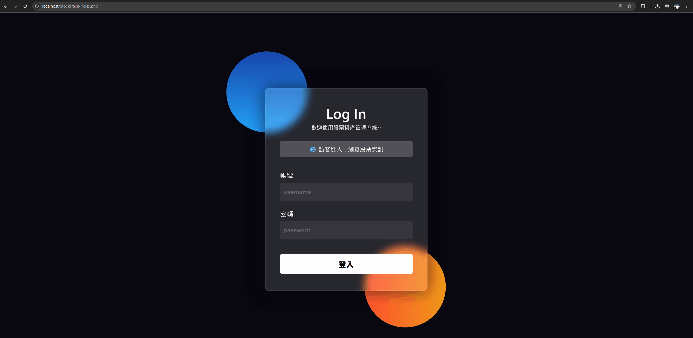

# StockTrack - Multi-Market Portfolio Management Web Application

##  Application Demo

<p align="center">
  
  
</p>

---
**StockTrack** is a dynamic 3-tier web application designed to solve the challenges of fragmented multi-brokerage portfolio management. Built with PHP, MySQL, and modern frontend design (Glassmorphism & W3.CSS), it allows investors to seamlessly consolidate and track Taiwan/US stock market assets, real-time market value, and unrealized profit/loss in one centralized dashboard.

---

##  Background & Motivation

With the rapid expansion of the semiconductor and AI industries in 2026, retail investment participation has surged dramatically. Many investors manage accounts across multiple brokerages and international markets (e.g., sub-brokerage accounts for US equities). Calculating total portfolio performance across multiple platforms traditionally required manual spreadsheet maintenance.

**StockTrack** addresses this pain point by offering a unified, one-stop portfolio tracking solution with automatic currency conversion and real-time P/L analysis.

---

##  Key Features & Highlights

- **Multi-Market Asset Tracking**: Automatically converts US dollar assets (USD/TWD) to deliver a consolidated view of total net worth in local currency.
- **Real-Time P/L & Financial Performance**: Dynamically calculates total market value, cost basis, unrealized profit/loss, and return percentages with color-coded visual indicators (green for gains, red for losses).
- **Guest Read-Only Preview Mode**: Unauthenticated visitors can freely browse current stock market lists while system write/edit operations remain strictly locked to protect data integrity.
- **Session-Based Authentication (RBAC)**: Enforces server-side PHP Session validation to prevent URL-bypassing and unauthorized inventory access.
- **Cascading Data Integrity**: Relational mapping ensures that deleting a stock from `stock_list` automatically purges orphaned records in `stock_inventory` to maintain database consistency.
- **Dynamic UI/UX State**: Responsive navigation header dynamically switches between Login/Logout controls with clear status alerts based on user authentication state.

---

##  System Architecture (3-Tier Model)


---

##  Database Schema Design

The database schema (`stock_db`) decouples stock market reference data from individual user holdings to maximize scalability and reduce redundancy.

### 1. `user_list` (Member Credentials)
| Field | Type | Key | Description |
| :--- | :--- | :--- | :--- |
| `USN` | `int(11)` | **PK / AUTO_INCREMENT** | Unique User Identification Number |
| `username` | `varchar(35)` | | Login Account Username |
| `password` | `varchar(35)` | | Account Password |
| `hashedPwd` | `varchar(65)` | | Password Hash (Reserved for Bcrypt expansion) |
| `uName` | `varchar(35)` | | User Display Name / Real Name |
| `uTitle` | `varchar(35)` | | User Title / Salutation |

### 2. `stock_list` (Market Equities Reference)
| Field | Type | Key | Description |
| :--- | :--- | :--- | :--- |
| `stock_id` | `int(11)` | **PK / AUTO_INCREMENT** | Unique Stock Identifier |
| `stock_code` | `varchar(10)` | | Stock Ticker (e.g., `2330`, `AAPL`) |
| `stock_name` | `varchar(50)` | | Company Name (e.g., TSMC, Apple) |
| `current_price` | `decimal(10,2)` | | Latest Market Price |
| `category` | `varchar(30)` | | Market Classification (e.g., 台股, 美股) |
| `update_time` | `date` | | Date of Last Price Update |

### 3. `stock_inventory` (User Asset Portfolio)
| Field | Type | Key | Description |
| :--- | :--- | :--- | :--- |
| `inventory_id` | `int(11)` | **PK / AUTO_INCREMENT** | Unique Inventory Record Identifier |
| `stock_id` | `int(11)` | **FK / INDEX** | Foreign Key referencing `stock_list.stock_id` |
| `quantity` | `decimal(10,2)` | | Shares Held (Supports fractional shares) |
| `avg_cost` | `decimal(10,2)` | | Average Cost Basis per Share |

---

##  Security & Best Practices

- **Configuration Decoupling**: Database credentials are environment-decoupled using `dbconfig.php.example` and protected via `.gitignore` to prevent secret leaks.
- **Session-Based Access Controls**: All direct file access to administrative endpoints (`add_data.php`, `inventory.php`) is guarded by PHP Session validation (`$_SESSION["loggedin"]`).

---

##  Local Setup Instructions

### Prerequisites
- [XAMPP](https://www.apachefriends.org/) or any Apache + PHP 8.x + MySQL local environment.

### Steps
1. **Clone the repository**:
   ```bash
   git clone [https://github.com/Rush1008-sudo/StockTrack.git](https://github.com/Rush1008-sudo/StockTrack.git)
   cd StockTrack   
   ```

2. Import Database:

- Open phpMyAdmin (http://localhost/phpmyadmin).

- Import the provided database dump file (schema.sql).

3. Configure Database Connection:

- Copy dbconfig.php.example to dbconfig.php:

    ```bash
    cp dbconfig.php.example dbconfig.php
    ```
- Update your MySQL credentials inside dbconfig.php.

4. Launch Application:

- Place the project folder into your local web root (htdocs/).

- Navigate to http://localhost/StockTrack/index.php in your browser.
